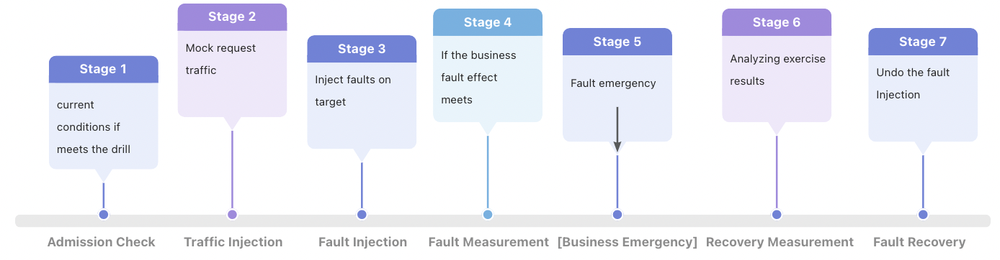
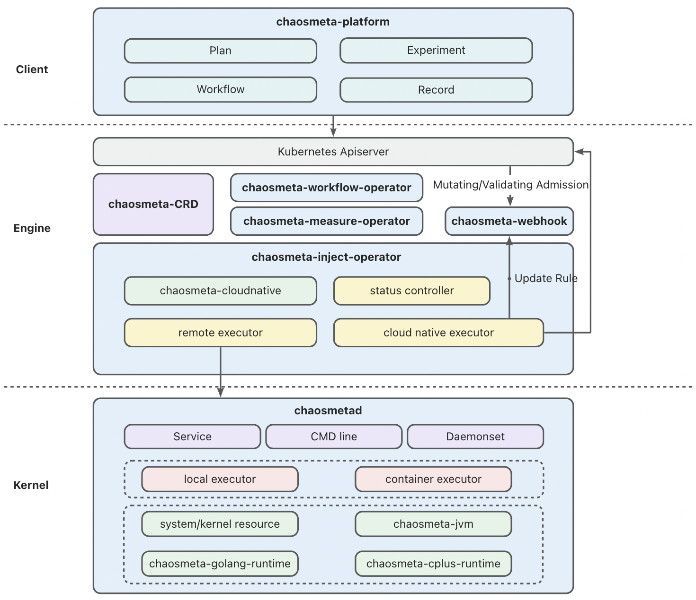
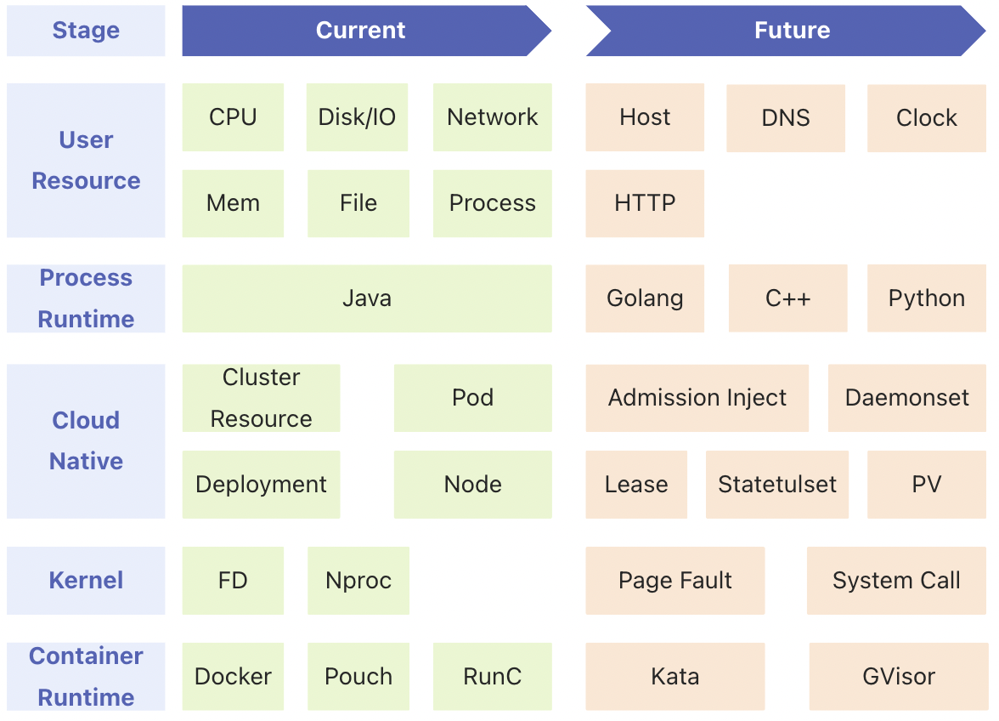

[中文版README](README_CN.md)
# Introduction
ChaosMeta is an open-source cloud-native chaos engineering platform developed by Ant Group. It embodies Ant Group's methodology, technology, and products accumulated over years of practice in large-scale red-blue team exercises at the company level. Guided by the "risk catalog" (a general risk scenario manual for various technical components within the company), and combined with technical practice, ChaosMeta provides protection for Ant Group's various major promotional activities over the years.

ChaosMeta is a platform dedicated to supporting the entire fault injection practice lifecycle and proposes a "chaos engineering lifecycle" model that covers multiple stages including Admission Check, Traffic Injection, Fault Injection, Fault Measurement, Recovery Measurement and Fault Recovery. While liberating user productivity, it is also pursuing the future form of chaos engineering: one-click automated practice, and even intelligent practice.


At the current stage, ChaosMeta has opened up rich fault injection capabilities to the outside world, which not only flexibly supports single-machine deployment and Kubernetes cloud-native deployment but also supports experimentation with cloud-native fault scenarios such as Kubernetes itself and Operators. It can help enterprises cope well with system complexity and uncertainty, thereby improving system reliability and stability.

# Core Advantages
#### One-click deployment, easy to use, easy to integrate, and low barriers to use
Support Kubernetes API, command line, HTTP and other methods.
#### A lot of practical experience fully verified, high functional reliability
The Ant Blue Army team has been deeply involved in the chaos engineering industry for many years. It holds company-level large-scale red and blue offensive and defensive drills every year for all businesses of the company, and many businesses also conduct 7X24-hour drills and monthly normal drills;
Internal drill object types cover cloud products, Kubernetes, Operator applications, databases (OceanBase, Etcd, etc.), middleware (message queues, distributed scheduling, configuration centers, etc.), business applications (Java applications, C++ applications, Golang applications).
#### High flexibility, supporting various user needs
No matter whether the user wants a complete chaos engineering platform, or only wants the underlying platform capabilities such as remote injection, orchestration and scheduling, or even only wants the single-machine fault injection capability, there are corresponding deployment solutions to meet the requirements.
#### Abundant fault injection capabilities, cloud-native chaos engineering
Because Ant Group attaches great importance to offensive and defensive drills, it has led to large-scale and high-frequency drills, which in turn has promoted the construction of various fault injection capabilities. And because Ant has a huge internal infrastructure scale, coupled with the low fault tolerance of finance, it has very high requirements for the stability of infrastructure such as Kubernetes and middleware. Therefore, Ant Chaos Engineering has accumulated rich fault capabilities in the cloud-native field. and practice experience.
#### The concept of chaos engineering is advanced, the platform is powerful, it supports the complete "chaos engineering life cycle", and it is oriented to automation
Ant Group has internally summarized a relatively mature exercise model: "Chaos Engineering Life Cycle", which is oriented to automated exercises. And ChaosMeta contains the supporting technologies of each stage.

Behind the rich drill experience, Ant Group has also precipitated a set of manuals containing common risk scenarios of technical components in various fields, called "risk catalog". ChaosMeta is based on the "chaos engineering life cycle" model and "risk catalog" On a theoretical basis, the automatic exercise function of one-click physical examination is realized, and the stability score of the target is directly output, which greatly liberates the human input of users in chaos engineering.

# Architecture Overview


##### Client
The Client layer is mainly composed of chaosmeta-platform components. Its main task is to lower the threshold for users to use, provide a visual interface, and facilitate users to use platform functions such as planning, arrangement, experimental configuration, and experimental record details.
##### Engine
The engine layer includes the core platform capabilities of ChaosMeta and the implementation of some cloud-native fault capabilities, including the following components:
- **chaosmeta-CRD**：ChaosMeta's platform capabilities are developed based on the Operator framework, so each type of capability has a corresponding CRD, and then the corresponding Operator monitors the status and executes the corresponding operation. For example, the CRD of the fault injection capability is experiments.inject.chaosmeta.io and the operator corresponding to monitoring is chaosmeta-inject-operator. Therefore, users can create corresponding CR instances through Kubectl or Kubernetes-Client to perform corresponding functions;


- **chaosmeta-inject-operator**：monitors the CR instance related to fault injection created by the user, compares the actual state of the CR in the cluster with the expected state in the control loop to execute the relevant fault injection logic and state flow, and tunes the actual state to the expected state. Perform different operations according to the fault type defined by the CR instance. For example, if it is a system resource fault, it needs to be injected remotely through chaosmeta-daemonset or HTTP or command channel; if it is a cloud-native fault, it will be injected based on Kubernetes APIServer , and if it involves a dynamic admission fault, it will also request chaosmeta-webhook to update the Mutating rules and Validating rules;


- **chaosmeta-webhook**：The API processing flow of each APIServer needs to go through authentication, authentication, and admission, and the admission stage will go through the stages of Mutating Admission Webhook (tampering) and Validating Admission Webhook (verification), and chaosmeta-webhook will Define update resource matching rules, and perform operations such as interception, tampering, delay, and exceptions on the user's Kubernetes resource creation request. This is very meaningful for Operator applications and fault drill scenarios related to the robustness of Kubernetes' own clusters.


- **chaosmeta-measure-operator**：This is the component used to perform the measurement function, mainly used in two phases: failure measurement and recovery measurement. The fault metric is an effective measure of the fault injection effect, and the recovery metric is the effective measure of the resilience of the defense platform. The ability to measure is the key ability to realize the automation and intelligence of chaos engineering.

*For example, the failure effect of a drill is expected to be that the number of successful requests for a certain service drops by 50%, and the corresponding defense platform is expected to be discovered within 5 minutes and recovered within 10 minutes. The execution method is realized by fully using the CPU. Then in the fault measurement stage, it is necessary to find the time point (fault effective point) when the number of successful service requests drops by 50% compared with that before the fault injection. In the recovery measurement phase, it is necessary to find the time point when the corresponding alarm is generated (fault discovery point), and also to find the time point (fault recovery point) at which the success rate is requested to restore the water level before the drill after the fault discovery point. Finally, an analysis report of this drill is generated, and the areas for improvement of the defense platform are given.*


- **chaosmeta-workflow-operator**：Provides fault orchestration capabilities. Because in reality, except for a single failure scenario. There is also a need for a large number of complex fault scenarios, which require a series-parallel combination of different fault injection capabilities for simulation. And orchestration is not limited to fault injection, but also includes orchestration nodes with different capabilities such as traffic injection, fault access detection, fault measurement, recovery measurement, etc. This is also a key capability to automate the exercise.
##### Kernel
The Kernel layer mainly includes the realization of single-machine fault injection capabilities, mainly including the chaosmetad component, which provides the way of resident HTTP service and command line execution, and also encapsulates the corresponding daemonset component (chaosmeta-daemonset). It can be flexibly matched with different training platforms.

# Current Stage
At the current stage, ChaosMeta only opens chaosmeta-inject-operator and chaosmetad to the outside world, so remote injection can only be performed based on kubectl to create CR or HTTP request, or directly use the stand-alone fault injection capability. In the future, all components and capabilities will be gradually opened to the outside world.
The currently supported failure capabilities are as follows:
- System Resources Exception: CPU, memory, network, disk, process, file, etc.;
- Kernel Resource Exception: fd, nproc, etc.;
- JVM Dynamic Injection: function call delay, function return value tampering, function throwing exception, etc.;
- Container Fault Injection: kill container, suspend container, CPU, memory, network, disk, process, file, JVM injection and other experimental scenarios in the container;
- Kubernetes Injection: execute experimental scenarios such as CPU, memory, network, disk, process, file, JVM injection on any pod;
- Cloud-Native Faults: Abnormalities in cluster resources such as accumulation of a large number of Pending Pods and Completed Jobs; there are also abnormalities in instances of cloud-native resources such as Deployment, Node, and Pod, such as copy expansion and shrinking tampering of Deployment instances, and injection of Pod instance Finalizers.

# Getting Started
#### Quick Start
```shell
# download docker mirror
docker pull ghcr.io/traas-stack/chaosmetad-demo:v0.1.0

# Run and enter the docker container
docker run --privileged -it ghcr.io/traas-stack/chaosmetad-demo:v0.1.0 /bin/bash

# make the environment variable take effect
source /etc/profile

# Start the test service
cd /home/demo && python -m SimpleHTTPServer 8080 > server.log 2>&1 &
curl 127.0.0.1:8080

# Create an experiment to inject a 2s network delay into the lo network card, and it will automatically recover after 10 minutes
chaosmetad inject network delay -i lo -l 2s --uid test-fg3g4 -t 10m

# View experiment information, test effect
chaosmetad query
curl 127.0.0.1:8080

# Manually recover the experiment
chaosmetad recover test-fg3g4
```
#### Failure Capability Use
For details, see: [Instruction for Use](https://chaosmeta.gitbook.io/chaosmeta-cn/gong-neng-shi-yong-shuo-ming)
#### Installation Guide
For details, see: [Installation Guide](https://chaosmeta.gitbook.io/chaosmeta-cn/an-zhuang-zhi-yin)
# Comminicate
Welcome to submit defects, questions, suggestions and new features, all problems can be submitted to [Github Issues](https://github.com/traas-stack/chaosmeta/issues/new), you can also contact us in the following ways:
- DingTalk Group: 21765030887
- Slack group: [ChaosMeta](https://app.slack.com/client/T057ERYMS8J/C057883SM38?geocode=zh-cn)
- WeChat public account: ChaosMeta混沌工程
- Email: chaosmeta.io@gmail.com
- WeChat group: Email communication/WeChat public account to get QR code invitation
# RoadMap
### Platform Capability
The future evolution of ChaosMeta platform capabilities is divided into three stages
##### Phase 1 - Manual Configuration
The goal to be achieved is to open all the components in the architecture diagram to the outside world. At this time, it can support the complete life cycle of chaos engineering, enter the field of primary automated chaos engineering, and use the "risk catalog" as a theoretical reference. Once manual configuration, multiple times automatically.

The order of opening to the outside world is as follows (if you have relevant needs, you are welcome to submit an issue, and priority adjustments will be considered):
- [x] Stand-alone fault injection tool：chaosmetad
- [x] Fault Remote Injection Engine：chaosmeta-inject-operator
- [ ] Platform Dashboard：chaosmeta-platform
- [ ] Risk Catalog：Common Risk Scenario Handbook for Technical Components in Each Field
- [ ] Orchestration Engine：chaosmeta-workflow-operator
- [ ] Metric Engine：chaosmeta-measure-operator
- [ ] Cloud Native Dynamic Access Fault Injection Capability：chaosmeta-webhook
##### Phase 2 - Automation
At this stage, the "Risk Catalog" will play a greater role. It not only gives the risk of a class of applications, but also the corresponding prevention and emergency recommendations, and the score of each item, and ChaosMeta will The "risk catalog" is integrated into a risk medical examination package of general components, which realizes the one-click "physical examination" capability, inputs target application information, and directly outputs a risk score and risk analysis report.
##### Phase 3 - intelligence
Explore the direction of combining artificial intelligence
### Fault Injection Capability
The following is just a classification of fault capabilities. For the specific atomic fault capabilities provided, please refer to the [description of fault capabilities](https://chaosmeta.gitbook.io/chaosmeta-cn/gong-neng-shi-yong-shuo-ming) (welcome to submit issues and put forward new capability requirements, and those with higher requirements are given priority):

# License
ChaosMeta is licensed under the Apache 2.0 license, please read [LICENSE](LICENSE) for details