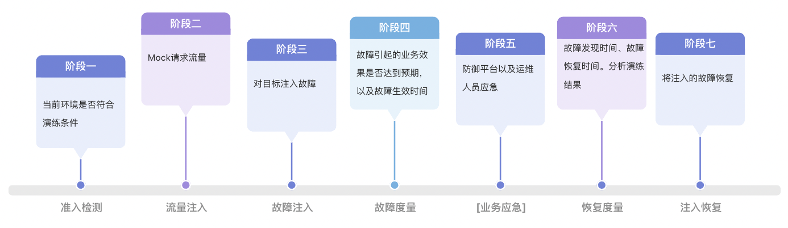

[官方文档](https://chaosmeta.gitbook.io/chaosmeta-cn)
# 简介

ChaosMeta 是蚂蚁集团开源的一款云原生混沌工程平台。它凝聚了蚂蚁集团在公司级大规模红蓝攻防演练实践中多年积累的方法论、技术以及产品。由“风险目录”（内部对各领域技术组件的通用风险场景手册）作为理论指导，结合技术实践，为蚂蚁集团多年的各种大促活动保驾护航。

ChaosMeta 是一个致力于支撑完整故障演练生命周期的平台，提出了一个“ **混沌工程生命周期** ”的模型，覆盖了准入检测、流量注入、故障注入、故障度量、故障恢复、恢复度量等多个阶段。为用户解放生产力的同时，也在追求着混沌工程的未来形态：一键自动化演练，甚至智能化演练。


在当前阶段，ChaosMeta 对外开放了丰富的故障注入能力，不仅灵活支持单机部署以及 Kubernetes 云原生部署，还支持对 Kubernetes 自身以及 Operator 等云原生故障场景进行实验。可以帮助企业很好地应对系统复杂性和不确定性，从而提高系统的可靠性和稳定性。

# 核心优势

#### 一键部署，简单易用，易集成，使用门槛低

支持Kubernetes API、命令行、HTTP等多种方式。

#### 大量实践经验充分验证，功能可靠性高

蚂蚁蓝军团队在混沌工程行业深耕多年，内部每年举行公司级大规模红蓝攻防演练活动，面向公司全体业务，并且也有不少业务进行7X24小时演练以及月度常态演练；


内部演练对象类型覆盖云产品、Kubernetes、Operator应用、数据库（OceanBase、Etcd等）、中间件（消息队列、分布式调度、配置中心等）、业务应用（Java应用、C++应用、Golang应用）。

#### 灵活性高，支撑多种用户需求

无论用户是想要一个完整的混沌工程平台，还是只想要底层的远程注入、编排调度等平台能力，甚至是只想要单机故障注入能力，都有相应的部署方案可以满足。

#### 丰富的故障注入能力，云原生混沌工程

由于蚂蚁集团对攻防演练的高度重视，促成了大规模高频率的演练活动，进而推动了各种各样的故障注入能力建设。并且因为蚂蚁内部有着庞大的基础设施规模，加上金融的低容错性，所以对Kubernetes、中间件等基础设施的稳定性要求非常高，因此蚂蚁混沌工程在云原生领域沉淀了比较丰富的故障能力以及演练经验。


#### 混沌工程理念先进，平台功能强大，支撑完整“混沌工程生命周期”，面向自动化

蚂蚁集团内部归纳了一套比较成熟的演练模型：“**混沌工程生命周期**”，面向自动化演练。而 ChaosMeta 则包含了其中各阶段的支撑技术。

在丰富的演练经验背后，蚂蚁集团还沉淀出了一套包含各领域技术组件的通用风险场景的手册，称为“风险目录”，ChaosMeta 则在“混沌工程生命周期”模型以及“风险目录”的理论基础上，实现**一键体检**的自动化演练功能，直接产出目标的稳定性分数，大大解放用户在混沌工程中的人力投入。

# 架构概览


##### 用户层（Client）
用户层主要是由 **chaosmeta-platform** 组件构成，其主要任务是降低用户使用的门槛，提供可视化界面，方便用户使用计划、编排、实验配置、实验记录详情等平台功能。
##### 引擎层（Engine）
引擎层包含了 ChaosMeta 的核心平台能力以及部分云原生故障能力的实现，包含以下组件：
- **chaosmeta-CRD**：ChaosMeta 的平台能力都是基于 Operator 框架开发的，因此每类能力都有对应的CRD，然后由对应的 Operator监听状态并执行对应操作。比如故障注入能力的 CRD 为 experiments.inject.chaosmeta.io 而对应监听的 operator 为 chaosmeta-inject-operator。因此用户可以通过 Kubectl 或者 Kubernetes-Client 创建对应的 CR 实例以执行相应的功能；


- **chaosmeta-inject-operator**：监听用户创建的故障注入相关的 CR 实例，在控制循环中把集群中 CR 的实际状态和期望状态对比以执行相关故障注入逻辑和状态流转，把实际状态调谐至期望状态。根据 CR 实例定义的故障类型执行不同的操作，比如：如果是系统资源类故障，则需要通过 chaosmeta-daemonset 或 HTTP 或 命令通道进行远程注入；如果是云原生类故障，则会基于 Kubernetes APIServer 进行注入，并且如果是涉及动态准入类故障，还会请求 chaosmeta-webhook 更新篡改规则和拦截规则；


- **chaosmeta-webhook**：每个 APIServer 的 API 处理流程都需要经过认证、鉴权、准入，而准入阶段会经过 Mutating Admission Webhook （篡改）和 Validating Admission Webhook （校验）阶段，chaosmeta-webhook 会根据故障定义更新资源匹配规则，对用户的 Kubernetes 资源创建请求进行拦截、篡改、延时、异常等操作。这对于 Operator 应用以及 Kubernetes 自身集群健壮性相关的故障演练场景非常有意义。


- **chaosmeta-measure-operator**：这是用于执行度量功能的组件，主要用于两个阶段：故障度量和恢复度量。故障度量是对故障注入效果的有效性度量，而恢复度量是对防御平台恢复能力的有效性度量。度量能力是实现混沌工程自动化以及智能化的关键能力。


  *举个例子，比如一次演练的故障效果预期是某个服务的请求成功量下跌50%，并且预期对应的防御平    台能5分钟内发现并且10分钟内恢复，执行手段是通过CPU打满实现。那么故障度量阶段就要找到相比故障      注入前服务请求成功量下跌50%的时间点（故障生效点）。恢复度量阶段就要找到对应告警的产生时间点（故障发现点），还要找到故障发现点后请求成功量恢复演练前水位的时间点（故障恢复点）。最后产生此次演练的分析报告，给出防御平台待改进的地方。*

- **chaosmeta-workflow-operator**：提供故障编排的能力。因为现实中，除了单一的故障场景外。还有大量复杂故障场景的需求，这就需要通过串并行组合不同的故障注入能力来进行模拟。并且编排还不止于故障注入，还可以包含流量注入、故障准入检测、故障度量、恢复度量等不同能力类型的编排节点，这也是让演练走向自动化的关键能力。


##### 内核层（Kernel）
内核层主要包含了单机故障注入能力的实现，主要包含了 **chaosmetad** 组件，提供了常驻 HTTP 服务的方式以及命令行执行的方式，还封装了对应的 daemonset 组件（**chaosmeta-daemonset**）。可灵活搭配不同需求的演练平台。

# 基本功能
当前阶段 ChaosMeta 只对外开放了 **chaosmeta-inject-operator** 和 **chaosmetad**，因此只能基于 kubectl 创建 CR 的方式或者 HTTP 请求的方式进行远程注入，或者直接使用单机故障注入能力。当前支持的故障能力如下（后续会逐步对外开放所有的组件和能力）：

- 系统资源异常：CPU、内存、网络、磁盘、进程、文件等；
- 内核资源异常：fd、nproc等；
- JVM动态注入：函数调用延迟、函数返回值篡改、函数抛出异常等；
- 容器故障注入：杀容器、暂停容器，容器内CPU、内存、网络、磁盘、进程、文件、JVM注入等实验场景；
- Kubernetes注入：对任意pod执行CPU、内存、网络、磁盘、进程、文件、JVM注入等实验场景；
- 云原生故障：集群资源异常比如大量Pending Pod堆积、Completed Job堆积等；还有Deployment、Node、Pod等云原生资源实例异常比如Deployment实例副本扩缩容篡改、Pod实例Finalizer注入等。

# 使用指引
#### 快速试用单机注入能力
```shell
# 下载镜像并运行容器
docker run --privileged -it registry.cn-hangzhou.aliyuncs.com/chaosmeta/chaosmetad-demo:v0.1.1 /bin/bash

# 使环境变量生效
source /etc/profile

# 启动测试服务
cd /tmp && python -m SimpleHTTPServer 8080 > server.log 2>&1 &
curl 127.0.0.1:8080

# 创建一个实验，给lo网卡注入2s网络延迟，10分钟后自动恢复
chaosmetad inject network delay -i lo -l 2s --uid test-fg3g4 -t 10m

# 查看实验信息，测试效果
chaosmetad query
curl 127.0.0.1:8080

# 人工恢复实验
chaosmetad recover test-fg3g4
```

#### 故障能力使用
详见：[功能使用说明](https://chaosmeta.gitbook.io/chaosmeta-cn/gong-neng-shi-yong-shuo-ming)
#### 安装指引
详见：[安装指引](https://chaosmeta.gitbook.io/chaosmeta-cn/an-zhuang-zhi-yin)
# 交流
欢迎提交缺陷、问题、建议和新功能，所有问题都可以提交到 [Github Issues](https://github.com/traas-stack/chaosmeta/issues/new)，你也可以通过以下方式联系我们：
- 钉钉群：21765030887
- Slack 群：[ChaosMeta](https://app.slack.com/client/T057ERYMS8J/C057883SM38?geocode=zh-cn)
- 微信公众号：ChaosMeta混沌工程
- 邮箱：chaosmeta.io@gmail.com
- 微信群：邮箱沟通/微信公众号获取二维码邀请

# 规划
### 平台能力
ChaosMeta 平台能力的未来演进分为三大阶段
##### 第一阶段-人工配置
要达到的目标是将架构图中的组件都完成对外开放，此时，即可支撑完整的混沌工程生命周期，进入初级自动化混沌工程领域，以“风险目录”作为理论参考，一次人工配置，多次自动执行。
对外开放顺序如下（如果有相关需求欢迎提交issue，会考虑进行优先级调整）：
- [x] 单机故障注入工具：chaosmetad
- [x] 故障远程注入引擎：chaosmeta-inject-operator
- [ ] 平台界面：chaosmeta-platform
- [ ] 风险目录：对各领域技术组件的通用风险场景手册
- [ ] 编排引擎：chaosmeta-workflow-operator
- [ ] 度量引擎：chaosmeta-measure-operator
- [ ] 云原生动态准入故障注入能力：chaosmeta-webhook
##### 第二阶段-自动化
此阶段下，“风险目录”会发挥更大的价值，它不仅仅给出一类应用会有什么风险，还有对应的预防以及应急建议，并且每一项的评分是多少，而 ChaosMeta 会将“风险目录”集成为通用组件的风险体检套餐，实现一键“体检”能力，输入目标应用信息，直接输出一个风险评分以及风险分析报告。
##### 第三阶段-智能化
探索结合人工智能的方向，自动生成更多未知的风险场景。
#### 故障注入能力
以下仅为故障能力分类，具体提供的原子故障能力详见[故障能力说明](https://chaosmeta.gitbook.io/chaosmeta-cn/gong-neng-shi-yong-shuo-ming)（欢迎提交issue，提出新能力需求，需求较高的优先提供）：


# License
ChaosMeta 遵循 Apache 2.0 许可证，详细内容请阅读 [LICENSE](LICENSE)
